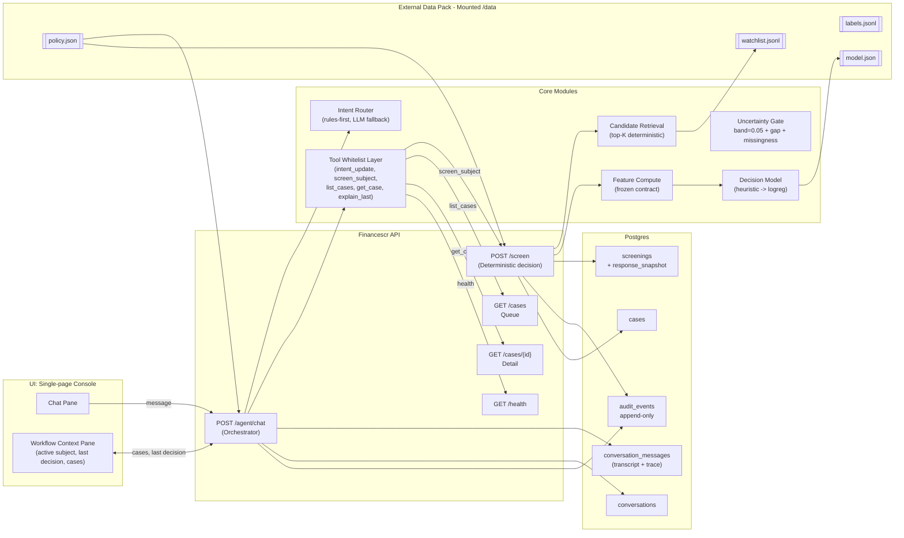

```mermaid
flowchart LR
  subgraph UI[UI: Single-page Console]
    UChat[Chat Pane]
    UCtx["Workflow Context Pane<br/>(active subject, last decision, cases)"]
  end

  subgraph API[Financescr API]
    Agent["POST /agent/chat<br/>(Orchestrator)"]
    Screen["POST /screen<br/>(Deterministic decision)"]
    Cases["GET /cases<br/>Queue"]
    Case["GET /cases/{id}<br/>Detail"]
    Health["GET /health"]
  end

  subgraph Core[Core Modules]
    Intent["Intent Router<br/>(rules-first, LLM fallback)"]
    Unc["Uncertainty Gate<br/>band=0.05 + gap + missingness"]
    Tools["Tool Whitelist Layer<br/>(intent_update, screen_subject,<br/>list_cases, get_case, explain_last)"]
    Scorer["Decision Model<br/>(heuristic -> logreg)"]
    Feats["Feature Compute<br/>(frozen contract)"]
    Retr["Candidate Retrieval<br/>(top-K deterministic)"]
  end

  subgraph DB["Postgres"]
    Screenings["screenings<br/>+ response_snapshot"]
    CasesT["cases"]
    Audit["audit_events<br/>append-only"]
    Convos["conversations"]
    Msgs["conversation_messages<br/>(transcript + trace)"]
  end

  subgraph DataPack["External Data Pack - Mounted /data"]
    Watchlist[[watchlist.jsonl]]
    Labels[[labels.jsonl]]
    Policy[[policy.json]]
    Model[[model.json]]
  end

  UChat -->|message| Agent
  Agent --> Intent
  Agent --> Tools
  Tools -->|screen_subject| Screen
  Tools -->|list_cases| Cases
  Tools -->|get_case| Case
  Tools -->|health| Health

  Screen --> Retr
  Retr --> Watchlist
  Screen --> Feats
  Feats --> Scorer
  Scorer --> Model

  Screen --> Screenings
  Screen --> Audit
  Screen --> CasesT

  Agent --> Msgs
  Agent --> Convos
  Agent --> Audit

  UCtx <-->|cases, last decision| Agent
  Policy --> Agent
  Policy --> Screen

```
